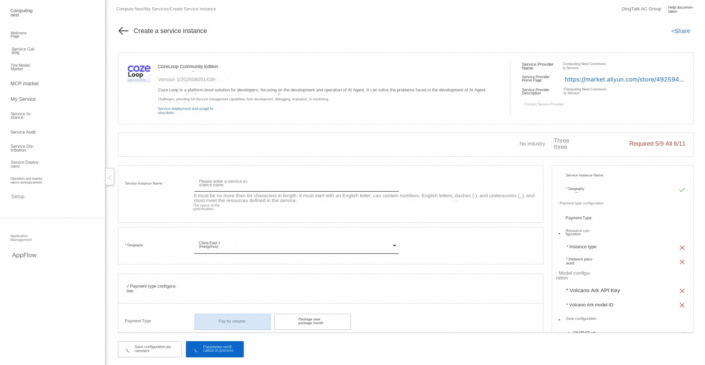
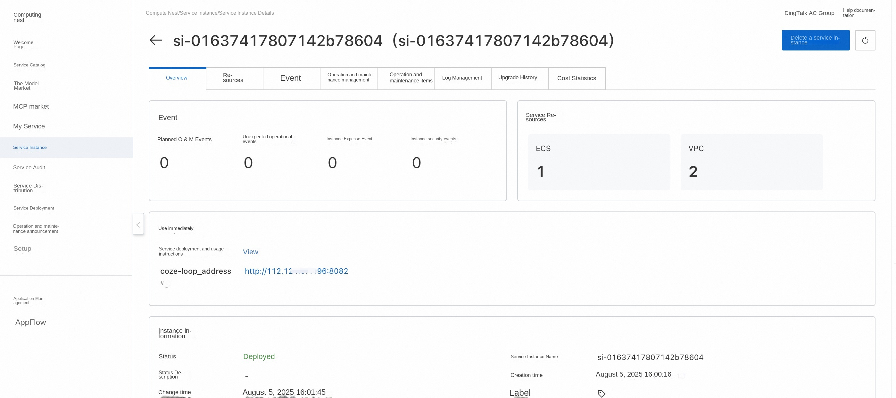
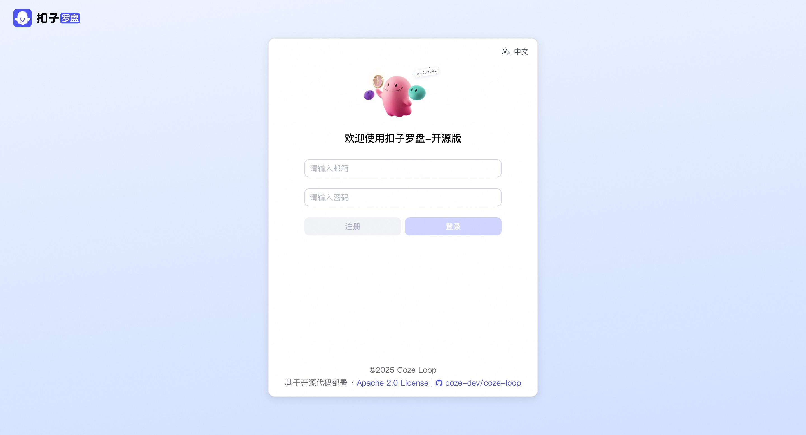

##🌟Service Introduction

[Coze Loop](https://www.coze.cn/loop) is an AI Agent development and operation and maintenance platform for developers, providing full life cycle management capabilities from development, debugging, evaluation to monitoring. It launches an open-source version of free and open core function modules, which developers can customize and extend based on to help AI Agent exploration and practice.

---

What does## Coze Loop do?
Coze Loop helps developers develop and operate AI agents more efficiently by providing full lifecycle management capabilities. Whether it is prompt word engineering, AI Agent evaluation, or monitoring and tuning after going online, Coze Loop provides powerful tools and intelligent support, greatly simplifying the development process of AI Agent and improving the operation effect and stability of AI Agent.

-Prompt development: The Prompt development module of Coze Loop provides developers with full process support from writing, debugging, optimization to version management. Real-time interactive testing of Prompt is realized through visual Playground, allowing developers to intuitively compare the output effects of different large language models.
-Evaluation: The Coze Loop evaluation module provides developers with systematic evaluation capabilities that enable multi-dimensional automated testing of the output effects of Prompt and button intelligences, such as accuracy, simplicity, and compliance.
-Observation: Coze Loop provides developers with the visual observation capability of the full link execution process, completely records every processing link from user input to AI output, including key nodes such as prompt analysis, model call and tool execution, and automatically captures intermediate results and abnormal states.

## Feature List

<table>
<thead>
<tr>
<th><strong> Features </strong></th>
<th><strong> Function Points </strong></th>
</tr>
</thead>
<tbody>
<tr>
<td>Prompt debugging </td>
<td>* Playground debugging and comparison   * Prompt version management </td>
</tr>
<tr>
<td> Evaluation </td>
<td>* Management Evaluation Set   * Management Evaluator   * Management Experiment </td>
</tr>
<tr>
<td> Observations </td>
<td>* SDK reports Trace   * Trace data observation </td>
</tr>
<tr>
<td> Model </td>
<td> Support access to OpenAI, Volcano Ark and other models </td>
</tr>
</tbody>
</table>

##💰Billing Description

The cost of CozeLoop Community Edition deployment in Computing Nest mainly involves:

-Selected vCPU and memory specifications
-System disk type and capacity
-public network bandwidth

##🚀Deployment process

1. Visit the Computing Nest CozeLoop Community Edition [Deployment Link](https://computenest.console.aliyun.com/service/instance/create/cn-hangzhou?type=user&ServiceId=service-fa1efc7a5e5649a2b800)
, fill in the deployment parameters as prompted:

2. After completing the parameters, you can see the corresponding RFQ details. After confirming the parameters, click **Next: Confirm Order**.

3. Confirm that the order is complete and agree to the service agreement and click **Create Now** to enter the deployment phase.

4. After the deployment is completed, you can start using the service. Enter the service instance details and click the service address.

5. Access the service address, register an account and use the CozeLoo Community Edition.

#📚Guidelines for use

For more use, please refer to the CozeLoop [official website document](https://www.coze.cn/open/docs/guides).