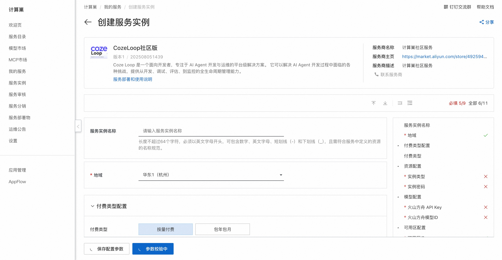
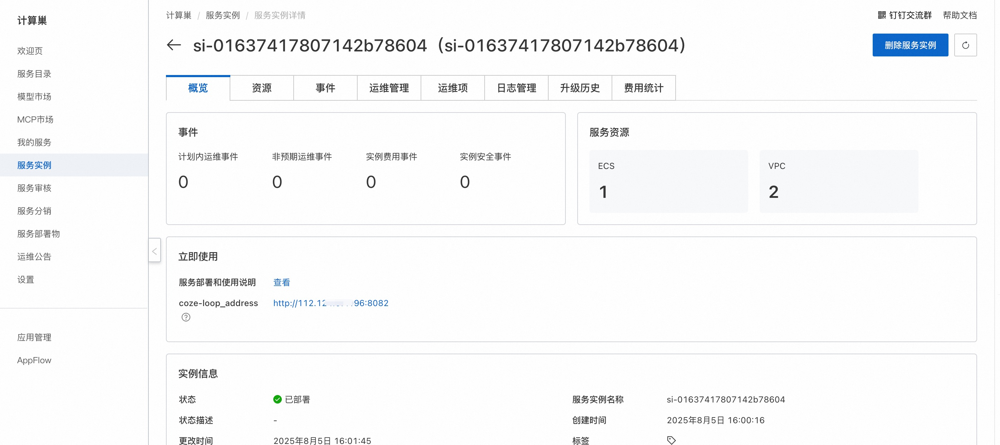

## 🌟 服务简介

<h2 tabindex="-1" class="heading-element" dir="auto">什么是 Coze Loop</h2><a id="user-content-什么是-coze-loop" class="anchor" aria-label="Permalink: 什么是 Coze Loop" href="#什么是-coze-loop"><svg class="octicon octicon-link" viewBox="0 0 16 16" version="1.1" width="16" height="16" aria-hidden="true"><path d="m7.775 3.275 1.25-1.25a3.5 3.5 0 1 1 4.95 4.95l-2.5 2.5a3.5 3.5 0 0 1-4.95 0 .751.751 0 0 1 .018-1.042.751.751 0 0 1 1.042-.018 1.998 1.998 0 0 0 2.83 0l2.5-2.5a2.002 2.002 0 0 0-2.83-2.83l-1.25 1.25a.751.751 0 0 1-1.042-.018.751.751 0 0 1-.018-1.042Zm-4.69 9.64a1.998 1.998 0 0 0 2.83 0l1.25-1.25a.751.751 0 0 1 1.042.018.751.751 0 0 1 .018 1.042l-1.25 1.25a3.5 3.5 0 1 1-4.95-4.95l2.5-2.5a3.5 3.5 0 0 1 4.95 0 .751.751 0 0 1-.018 1.042.751.751 0 0 1-1.042.018 1.998 1.998 0 0 0-2.83 0l-2.5 2.5a1.998 1.998 0 0 0 0 2.83Z"></path></svg></a>

<a href="https://www.coze.cn/loop" rel="nofollow">Coze Loop </a> 是一个面向开发者，专注于 AI Agent 开发与运维的平台级解决方案。 它可以解决 AI Agent 开发过程中面临的各种挑战，提供从开发、调试、评估、到监控的全生命周期管理能力。

Coze Loop 在商业化版本的基础上，推出开源版免费对开发者开放核心基础功能模块，以开源模式共享核心技术框架，开发者可根据业务需求定制与扩展，便于社区共建、分享交流，助力开发者零门槛参与 AI Agent 的探索与实践。

<h2 tabindex="-1" class="heading-element" dir="auto">Coze Loop 能做什么？</h2><a id="user-content-coze-loop-能做什么" class="anchor" aria-label="Permalink: Coze Loop 能做什么？" href="#coze-loop-能做什么"><svg class="octicon octicon-link" viewBox="0 0 16 16" version="1.1" width="16" height="16" aria-hidden="true"><path d="m7.775 3.275 1.25-1.25a3.5 3.5 0 1 1 4.95 4.95l-2.5 2.5a3.5 3.5 0 0 1-4.95 0 .751.751 0 0 1 .018-1.042.751.751 0 0 1 1.042-.018 1.998 1.998 0 0 0 2.83 0l2.5-2.5a2.002 2.002 0 0 0-2.83-2.83l-1.25 1.25a.751.751 0 0 1-1.042-.018.751.751 0 0 1-.018-1.042Zm-4.69 9.64a1.998 1.998 0 0 0 2.83 0l1.25-1.25a.751.751 0 0 1 1.042.018.751.751 0 0 1 .018 1.042l-1.25 1.25a3.5 3.5 0 1 1-4.95-4.95l2.5-2.5a3.5 3.5 0 0 1 4.95 0 .751.751 0 0 1-.018 1.042.751.751 0 0 1-1.042.018 1.998 1.998 0 0 0-2.83 0l-2.5 2.5a1.998 1.998 0 0 0 0 2.83Z"></path></svg></a>

Coze Loop 通过提供全生命周期的管理能力，帮助开发者更高效地开发和运维 AI Agent。无论是提示词工程、AI Agent 评测，还是上线后的监控与调优，Coze Loop 都提供了强大的工具和智能化的支持，极大地简化了 AI Agent 的开发流程，提升了 AI Agent 的运行效果和稳定性。

<ul dir="auto">
<li><strong>Prompt 开发</strong>：Coze Loop 的 Prompt 开发模块为开发者提供了从编写、调试、优化到版本管理的全流程支持，通过可视化 Playground 实现 Prompt 的实时交互测试，让开发者能够直观比较不同大语言模型的输出效果。</li>
<li><strong>评测</strong>：Coze Loop 评测模块为开发者提供系统化的评测能力，能够对 Prompt 和扣子智能体的输出效果进行多维度自动化检测，例如准确性、简洁性和合规性等。</li>
<li><strong>观测</strong>：Coze Loop 为开发者提供了全链路执行过程的可视化观测能力，完整记录从用户输入到 AI 输出的每个处理环节，包括 Prompt 解析、模型调用和工具执行等关键节点，并自动捕获中间结果和异常状态。</li>
</ul>

<h2 tabindex="-1" class="heading-element" dir="auto">功能清单</h2><a id="user-content-功能清单" class="anchor" aria-label="Permalink: 功能清单" href="#功能清单"><svg class="octicon octicon-link" viewBox="0 0 16 16" version="1.1" width="16" height="16" aria-hidden="true"><path d="m7.775 3.275 1.25-1.25a3.5 3.5 0 1 1 4.95 4.95l-2.5 2.5a3.5 3.5 0 0 1-4.95 0 .751.751 0 0 1 .018-1.042.751.751 0 0 1 1.042-.018 1.998 1.998 0 0 0 2.83 0l2.5-2.5a2.002 2.002 0 0 0-2.83-2.83l-1.25 1.25a.751.751 0 0 1-1.042-.018.751.751 0 0 1-.018-1.042Zm-4.69 9.64a1.998 1.998 0 0 0 2.83 0l1.25-1.25a.751.751 0 0 1 1.042.018.751.751 0 0 1 .018 1.042l-1.25 1.25a3.5 3.5 0 1 1-4.95-4.95l2.5-2.5a3.5 3.5 0 0 1 4.95 0 .751.751 0 0 1-.018 1.042.751.751 0 0 1-1.042.018 1.998 1.998 0 0 0-2.83 0l-2.5 2.5a1.998 1.998 0 0 0 0 2.83Z"></path></svg></a>

<markdown-accessiblity-table>
<table>
<thead>
<tr>
<th><strong>功能</strong></th>
<th><strong>功能点</strong></th>
</tr>
</thead>
<tbody>
<tr>
<td>Prompt 调试</td>
<td>* Playground 调试、对比   * Prompt 版本管理</td>
</tr>
<tr>
<td>评测</td>
<td>* 管理评测集   * 管理评估器   * 管理实验</td>
</tr>
<tr>
<td>观测</td>
<td>* SDK 上报 Trace   * Trace 数据观测</td>
</tr>
<tr>
<td>模型</td>
<td>支持接入 OpenAI、火山方舟等模型</td>
</tr>
</tbody>
</table>
</markdown-accessiblity-table>

## 💰 计费说明

CozeLoop社区版在计算巢部署的费用主要涉及：

- 所选vCPU与内存规格
- 系统盘类型及容量
- 公网带宽

## 🚀 部署流程

1. 访问计算巢CozeLoop社区版[部署链接](https://computenest.console.aliyun.com/service/instance/create/cn-hangzhou?type=user&ServiceId=service-fa1efc7a5e5649a2b800)
，按提示填写部署参数：
   

2. 参数填写完成后可以看到对应询价明细，确认参数后点击**下一步：确认订单**。

3. 确认订单完成后同意服务协议并点击**立即创建**进入部署阶段。

4. 等待部署完成后就可以开始使用服务，进入服务实例详情点击服务地址。
   

5. 访问服务地址，注册账号并使用CozeLoo社区版。
   

# 📚 使用指南

更多用法请参考CozeLoop[官网文档](https://www.coze.cn/open/docs/guides)。